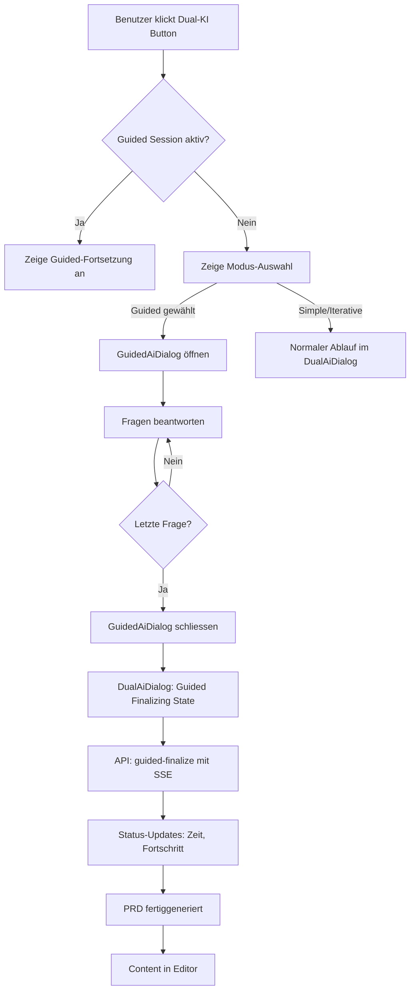

# Guided Workflow Unified Finalization - Implementierungsplan

**Author:** rahn  
**Datum:** 02.03.2025  
**Version:** 1.0

---

## 1. PROBLEMÜBERSICHT

### Aktuelles Verhalten (Problem)
- Guided Workflow öffnet separates [`GuidedAiDialog`](client/src/components/GuidedAiDialog.tsx:1)-Fenster
- Nach Schliessen des Fensters ist der Workflow im [`DualAiDialog`](client/src/components/DualAiDialog.tsx:1) nicht sichtbar
- Benutzer muss Guided explizit auswählen, Text eingeben und Start klicken, um Session wiederherzustellen
- Finale PRD-Generierung läuft im Guided-Dialog, nicht im Dual-Dialog

### Zielverhalten (Lösung)
- Alle drei Workflows (Simple, Iterative, Guided) zeigen finale Generierung im DualAiDialog an
- Guided Workflow: Fragephase im GuidedDialog → Finalisierung im DualAiDialog
- Einheitliche Wiederaufnahme-Logik für alle Modi
- Konsistente Statusanzeige mit Zeit, Fortschritt, Metainformationen

---

## 2. ARCHITEKTURÄNDERUNGEN

### Mermaid-Diagramm: Neuer Workflow



---

## 3. KOMPONENTEN-ÄNDERUNGEN

### 3.1 DualAiDialog.tsx

**Neue States:**
```typescript
// Bestehende Steps erweitern
type WorkflowStep = 'idle' | 'generating' | 'reviewing' | 'improving' | 'iterating' | 'guided-finalizing' | 'done';

// Neue States für Guided Finalisierung
const [guidedSessionId, setGuidedSessionId] = useState<string | null>(null);
const [guidedProgressDetail, setGuidedProgressDetail] = useState('');
```

**Neue Handler:**
- `handleGuidedFinalize(sessionId: string)` - Führt finale PRD-Generierung durch
- `checkForActiveGuidedSession()` - Prüft auf aktive Guided-Session beim Öffnen

**UI-Anpassungen:**
- Neuer Status-Text: "PRD wird basierend auf Ihren Antworten generiert..."
- Zeit- und Token-Anzeige wie bei anderen Modi
- Fortschrittsbalken für Guided-Finalisierung

### 3.2 GuidedAiDialog.tsx

**Geänderte Finalisierung:**
```typescript
// Statt direkter Finalisierung:
// Alt: await handleFinalize(sessionId);
// Neu: Callback an Parent und schliessen

onComplete(sessionId); // Übergibt Session-ID an DualAiDialog
// Closing via parent - onComplete löst im Parent das Schliessen aus
```

**Neue Props:**
```typescript
interface GuidedAiDialogProps {
  // ... bestehende Props
  onComplete?: (sessionId: string) => void; // Wird nach letzter Frage aufgerufen
}
```

**Session-Speicherung:**
- Speichert Session-ID im localStorage für Wiederherstellung
- Markiert Session als "ready_for_finalization"

### 3.3 Neue API-Endpunkte

**POST /api/ai/guided-finalize-stream**
- SSE-basierter Endpunkt für finale PRD-Generierung
- Ereignisse: `generation_start`, `progress`, `feature_expansion`, `compiler_gate`, `complete`
- Analog zu `/api/ai/generate-iterative`

**GET /api/ai/guided-session-status/:sessionId**
- Prüft ob Session existiert und bereit für Finalisierung
- Wird beim Öffnen des DualAiDialogs aufgerufen

### 3.4 Server-Änderungen

**guidedAiService.ts:**
- Neue Methode: `finalizePRDWithStream()` - SSE-basierte Finalisierung
- Anpassung: `finalizePRD()` für Streaming-Modus erweitern

**Neue Datei: server/guidedFinalizeStream.ts**
- SSE-Handler für Guided Finalisierung
- Ähnliche Struktur wie iterative generation

---

## 4. STATE-SYNCHRONISATION

### LocalStorage-Schema
```typescript
interface GuidedSessionStorage {
  sessionId: string;
  timestamp: number;
  status: 'questions' | 'ready_for_finalization' | 'finalizing';
  projectIdea: string;
  answersCount: number;
}
```

### Ablauf
1. GuidedDialog speichert Session nach letzter Antwort mit Status `ready_for_finalization`
2. DualAiDialog prüft beim Öffnen auf solche Sessions
3. Zeigt entsprechenden Wiederaufnahme-Dialog an
4. Bei Finalisierung: Status auf `finalizing` setzen
5. Nach Abschluss: Session aus localStorage entfernen

---

## 5. UI/UX-ANPASSUNGEN

### DualAiDialog - Neue Status-Anzeige
```
┌─────────────────────────────────────┐
│  Dual-KI Assistent                  │
├─────────────────────────────────────┤
│  [Status: Guided Finalisierung]     │
│                                     │
│  📝 PRD wird generiert...           │
│  Basierend auf Ihren 8 Antworten    │
│                                     │
│  ⏱️ 00:42 vergangen                 │
│  🔤 12,450 Tokens                   │
│                                     │
│  [████████████░░░░] 75%             │
│  Feature-Expansion läuft...         │
│                                     │
│  [Abbrechen]                        │
└─────────────────────────────────────┘
```

### Wiederaufnahme-Dialog
Wenn Benutzer Dual-KI öffnet und Guided-Session läuft:
```
┌─────────────────────────────────────┐
│  Guided Workflow fortsetzen?        │
├─────────────────────────────────────┤
│  Sie haben einen Guided Workflow    │
│  mit 5 beantworteten Fragen.        │
│                                     │
│  [Neu starten]  [Fortsetzen]        │
└─────────────────────────────────────┘
```

---

## 6. IMPLEMENTIERUNGSREIHENFOLGE

1. **Backend:** SSE-Endpunkt für Guided Finalisierung
2. **GuidedAiDialog:** Callback-Mechanismus statt direkter Finalisierung
3. **DualAiDialog:** Neuen State und Handler für Guided Finalisierung
4. **State-Synchronisation:** LocalStorage-Integration
5. **Wiederaufnahme:** Dialog für aktive Sessions
6. **Testing:** E2E-Tests anpassen

---

## 7. RISIKEN & MITIGATION

| Risiko | Mitigation |
|--------|------------|
| Session-Verlust bei Browser-Crash | Server-seitige Session-Speicherung (besteht bereits) |
| Komplexe State-Übergabe | Klare Props-Interfaces, TypeScript-Typen |
| UI-Inkonsistenzen | Wiederverwendung bestehender Komponenten |
| Breaking Changes | Inkrementelle Umstellung, Fallback-Modus |

---

## 8. TESTSTRATEGIE

- **Unit Tests:** Neue Handler im DualAiDialog
- **Integration:** API-Endpunkt mit SSE
- **E2E:** Kompletter Workflow: Start → Fragen → Finalisierung → Ergebnis
- **Edge Cases:** Browser-Reload, Abbruch, Netzwerkfehler

---

## 9. ABHÄNGIGKEITEN

- Bestehende [`GuidedAiService`](server/guidedAiService.ts:1)-Struktur
- [`DualAiDialog`](client/src/components/DualAiDialog.tsx:1)-Komponente
- SSE-Infrastruktur (bereits für Iterative vorhanden)
- [`localStorage`](client/src/components/GuidedAiDialog.tsx:48)-Session-Management

---

## ZUSAMMENFASSUNG

Die Umstellung ermöglicht eine einheitliche Benutzererfahrung über alle drei Workflow-Modi. Die finale PRD-Generierung erfolgt konsistent im DualAiDialog mit Zeitangabe, Fortschrittsbalken und Status-Updates. Die Wiederaufnahme eines Guided Workflows wird intuitiv - der Benutzer sieht sofort den aktuellen Status beim Öffnen des Dual-KI-Assistenten.
